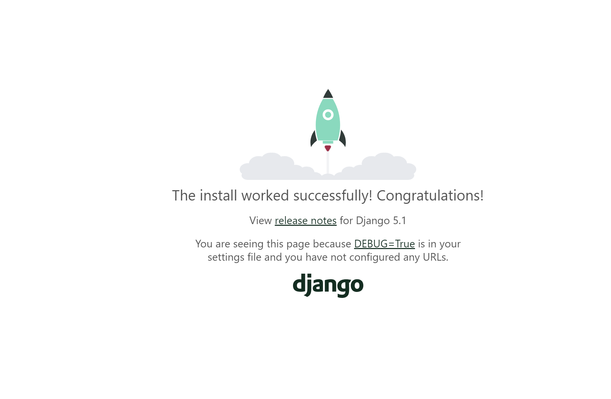
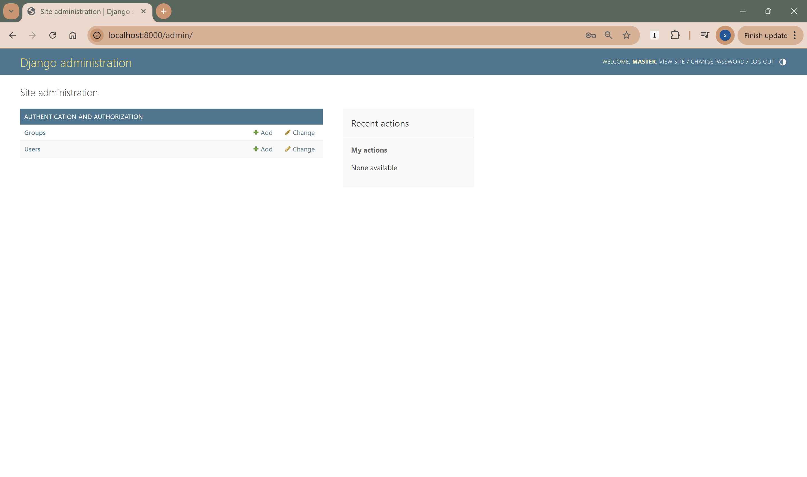
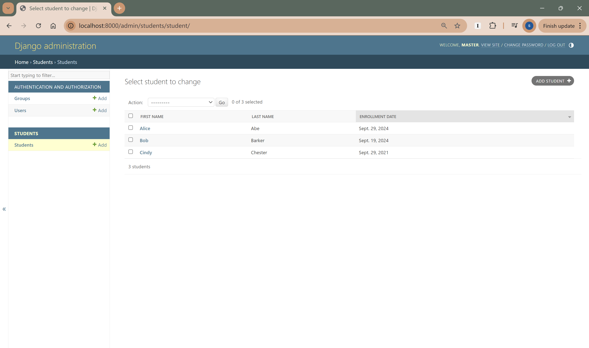

# Student Management System Report
## 1. Project Setup
### Set up the development environment

### Start the Django project
In the console, use the following command to start the Django project.
```
django-admin startproject student_management .
```
Note: If there is no dot at the end, Django will create a nested project directory, e.g. `/student_management/student_management`.
Use the following command to run the project.
```
py manage.py runserver
```
The project runs successfully.


### Add the students app

## 2. Create Student Model
### Describe the database schema in models.py
### Create a migration
### Apply the migrations and create databases

## 3. Set up admin interface
### Apply existing migrations
```shell
(venv) D:\24fall-term\GNG5300\Django-projects\student_management>python manage.py migrate
Operations to perform:
  Apply all migrations: admin, auth, contenttypes, sessions, students
Running migrations:
  ...
```
### Add a superuser
```
python manage.py createsuperuser
```
Navigate to `http://localhost:8000/admin/` and log in with the credentials to see the following page:



### Register the Student model in the Django admin panel
In the students folder, find admin.py and register the model using the following code:

### Customize the list display

