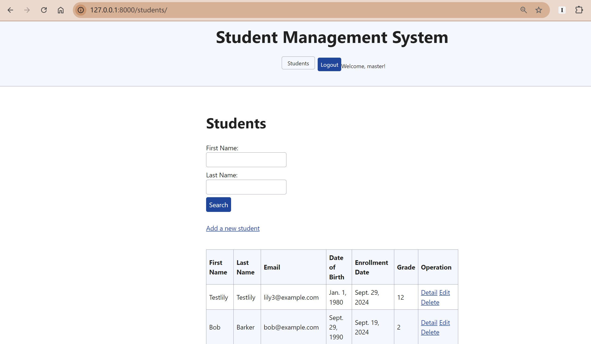
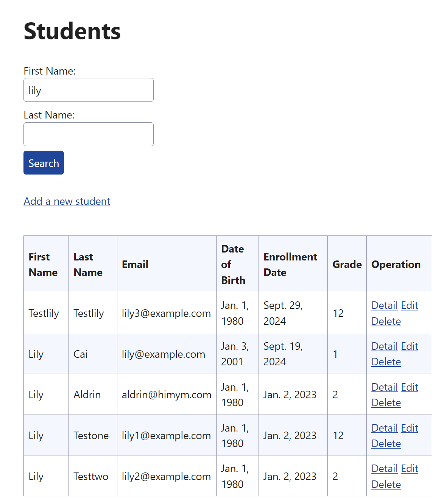
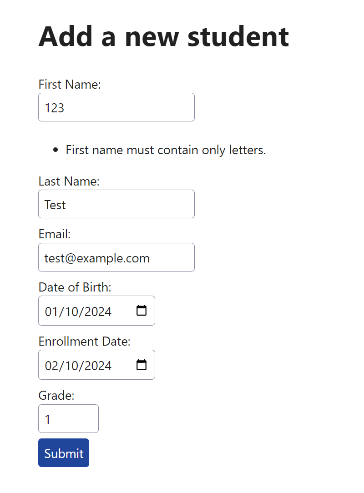
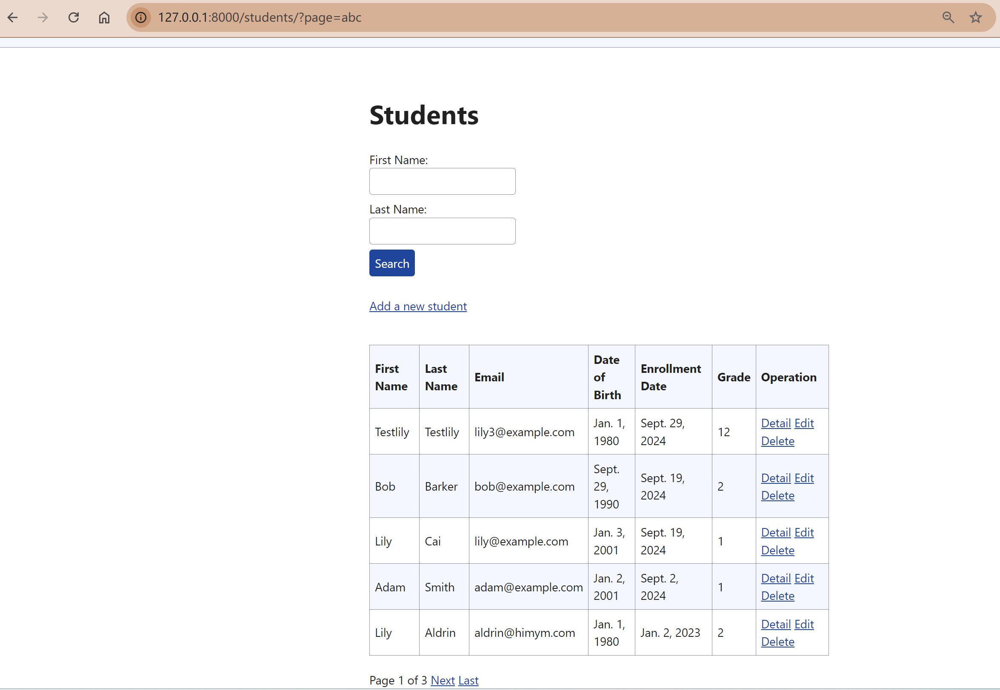

# Student Management System Report
## 0. Overview
The Student Management System is a web-based application designed to manage student data efficiently for educational institutes. The primary goal of the system is to allow administrators to add, edit, delete student information, with features like search functionality and pagination to handle large volumes of data.

The project uses Django for backend development and HTML/CSS for the user interface. The system is secured with user authentication to restrict certain actions to authorized users only. Additionally, the system has robust error handling and input validation to ensure data integrity.
## 1. Project Setup
### Set up the development environment
I created a virtual environment to manage dependencies. Open command inside the project root directory and set up the virtual environment
```shell
python -m venv venv
```
Next, activate the virtual environment:
```shell
.\venv\Scripts\activate
```

Seeing the following line means that the virtual environment is successfully activated:
```shell
(venv) D:\24fall-term\GNG5300\Django-projects>
```

Then, set up the virtual environment with necessary dependencies. Install Django using `pip`:
```shell
(venv) $ python -m pip install Django
```
### Start the Django project
In the console, use the following command to start the Django project.
```
django-admin startproject student_management .
```
Note: If there is no dot at the end, Django will create a nested project directory, e.g. `/student_management/student_management`.

Use the following command to run the project.
```
py manage.py runserver
```
Go to `http://127.0.0.1:8000/` and the following should show up. The project runs successfully.


### Add the students app
Create a new Django app named `students`:
```shell
python manage.py startapp students
```
Next, install the app in project `student_management`. In `student_management\settings.py`, add the configuration class of `students` app:
```py
# settings.py
INSTALLED_APPS = [
    'students.apps.StudentsConfig', # Add this line
    'django.contrib.admin',
    'django.contrib.auth',
    'django.contrib.contenttypes',
    'django.contrib.sessions',
    'django.contrib.messages',
    'django.contrib.staticfiles',
]
```

## 2. Create Student Model
To store student data and to display it on the website, I use Django's built-in ORM to create models to represent database tables. 
### Describe the database schema in models.py
Create a `Student` model to store information:
```py
# students/model.py
from django.db import models

class Student(models.Model):
    first_name = models.CharField(max_length=255)
    last_name = models.CharField(max_length=255)
    email = models.EmailField()
    date_of_birth = models.DateField()
    enrollment_date = models.DateField()
    grade = models.IntegerField()
```

### Create a migration
The Student model in `models.py` is a description of the database schema. To actually create the database, first I need to create a migration, which is a file containing the changes Django needs to make to the database. In the project directory `student_management`, use command:
```shell
python manage.py makemigrations students
```
### Apply the migrations and create databases
After generate migrations, I need to apply the migrations to create databases:
```shell
python manage.py migrate students
```

## 3. Set up admin interface
The Django admin site allows me to create, update and delete instances of students through a nice web interface.
### Apply existing migrations
First, apply some existing migrations in Django:
```shell
(venv) D:\24fall-term\GNG5300\Django-projects\student_management>python manage.py migrate
Operations to perform:
  Apply all migrations: admin, auth, contenttypes, sessions, students
Running migrations:
  ...
```
### Add a superuser
Then add myself as the superuser:
```
python manage.py createsuperuser
```
Navigate to `http://localhost:8000/admin/` and log in with the credentials to see the following page:


### Register the Student model and customize the list display
In the students folder, find admin.py and register the model using the following code:
```python
from django.contrib import admin
from .models import Student

# Register your models here.
class StudentAdmin(admin.ModelAdmin):
    list_display = ('first_name', 'last_name', 'enrollment_date')
    ordering = ('-enrollment_date',)

admin.site.register(Student, StudentAdmin)
```
Now the Student model is visible in the admin page, and it only displays the first name, last name, and enrollment date.


## 4. Views and Templates
I created five view functions for my students app in the `views.py` file in the `students/` directory:
- **students_list( )** will display a list of all students.
- **students_detail( )** will display the detail of one student. 
- **students_add( )** will later show a form to allow users to add a new student.
- **students_edit( )** will later show a form to allow users to update information of an existing student.
- **students_delete()** will delete the selected student

```python
# students/views.py
from django.shortcuts import render
from students.models import Student

'''Display a list of all students'''
def students_list(request):
    students = Student.objects.all().order_by('-enrollment_date')
    context = {
        'students': students,
    }
    return render(request, 'students/list.html', context)

'''Display the details of a single student'''
def students_detail(request, student_id):
    student = Student.objects.get(id=student_id)
    context = {
        'student': student,
    }
    return render(request, 'students/detail.html', context)

'''Add a new student'''
def students_add(request):
    return render(request, 'students/add.html')

'''Edit an existing student'''
def students_edit(request, student_id):
    student = Student.objects.get(id=student_id)
    context = {
        'student': student,
    }
    return render(request, 'students/edit.html', context)

'''Delete an existing student'''
def students_delete(request, student_id):
    student = Student.objects.get(id=student_id)
    student.delete()
    return HttpResponseRedirect('/students/')
```
### Build the templates
I built four templates for adding, listing, editing and displaying the details of student information in students folder and one `base.html` in the templates in the project folder. 

Specific codes can be seen in the repository.
### Include routes for urls
Create `urls.py` in `students/` and add the urls for the five views:
```py
from django.urls import path
from django.contrib.auth import views as auth_views
from . import views

urlpatterns = [
    path("", views.students_list, name="students_list"),
    path("detail/<int:student_id>/", views.students_detail, name="students_detail"),
    path("add/", views.students_add, name="students_add"),
    path("edit/<int:student_id>/", views.students_edit, name="students_edit"),
    path("delete/<int:student_id>/", views.students_delete, name="students_delete"),
]
```
Once the app-specific URLs are ready, add them in the project configuration in `student_management/urls.py` using `include()`:
```py
from django.contrib import admin
from django.urls import path, include
urlpatterns = [
    path('admin/', admin.site.urls),
    path('students/', include('students.urls')),
]
```

This is what each web page looks like:
### Display a list of all students

Url:  `http://localhost:8000/students/`
It displays a list of all students, with detail and edit button at the end of each row. It also has a button for adding a new student at the end of the list.
### Display the details of a single student

Url: `http://localhost:8000/students/detail/1/`
It shows details of a single student and has a button for editing the student's information.
### Add a new student

It is an empty page for now.
### Edit an existing student’s information

It is an empty page for now.
### Delete a student
Add `delete` button on the list page:
```html
<!--list.html-->
<tbody>
    
        <tr>
            <td>{{ student.first_name }}</td>
            <!--Other columns...-->
            <td>
                <!--Other buttons...-->
                <a href="" class="btn btn-danger">Delete</a>
            </td>
        </tr>
    
</tbody>
```

Also add `delete` button on the student detail page by updating `details.html`.

### Make the page look nicer
Use `base.html` and an external CSS library to make the page look nicer:

```html
<!-- templates/base.html -->

<!DOCTYPE html>
<html lang="en">
<head>
    <meta charset="utf-8">
    <title>Student Management System</title>
    <link rel="stylesheet" href="https://cdn.simplecss.org/simple.min.css">
</head>
<body>
    <header>
        <h1>Student Management System</h1>
        <nav>
            <ul>
                <li><a href="">Students</a></li>
                
                <!-- Conditional Login/Logout Button -->
                
                    <li>
                        <form method="post" action="">
                            
                            <button type="submit">Logout</button>
                        </form>
                    </li>
                    <li>Welcome, {{ user.username }}!</li>
                
                    <li><a href="">Login</a></li>
                
            </ul>
        </nav>
    </header>
    <hr>
    
    
</body>
</html>
```

## 5. Forms
Forms are used to add and edit student information. 
### Create StudentForm
Create `forms.py` under `students` app folder, add the `StudentForm` class with all the fields of student.

By using the built-in `EmailField`, Django will automatically check the format of email input. Also the attributes of `IntegerField` makes Django validate whether grade input is between 1 and 12 automatically.

```python
# students/forms.py
from django import forms

class StudentForm(forms.Form):
    first_name = forms.CharField(max_length=100)
    last_name = forms.CharField(max_length=100)
    email = forms.EmailField()
    date_of_birth = forms.DateField()
    enrollment_date = forms.DateField()
    grade = forms.IntegerField(min_value=1, max_value=12)

```
### Add a student
1. Update `views.py`
```py
# students/views.py
'''Add a new student'''
def students_add(request):
    form = StudentForm()
    if request.method == 'POST':
        form = StudentForm(request.POST)
        if form.is_valid():
            student = Student(
                first_name=form.cleaned_data['first_name'],
                last_name=form.cleaned_data['last_name'],
                email=form.cleaned_data['email'],
                date_of_birth=form.cleaned_data['date_of_birth'],
                enrollment_date=form.cleaned_data['enrollment_date'],
                grade=form.cleaned_data['grade'],
            )
            student.save()
            return HttpResponseRedirect('/students/')
    context = {
        'form': StudentForm(),
        }
    return render(request, 'students/add.html', context)
```
2. Update `add.html` template.
```html
<!-- students/templates/students/add.html-->



    <h2>Add a new student</h2>



    <form method="post">
        
        {{ form.as_p }}
        <button type="submit" class="btn btn-primary">Submit</button>
    </form>

```

Now the page for adding students looks:


### Edit information of an existing student
Update `views.py`
```py
'''Edit an existing student'''
def students_edit(request, student_id):
    student = Student.objects.get(id=student_id)
    if request.method == 'POST':
        form = StudentForm(request.POST)
        if form.is_valid():
            student.first_name = form.cleaned_data['first_name']
            student.last_name = form.cleaned_data['last_name']
            student.email = form.cleaned_data['email']
            student.date_of_birth = form.cleaned_data['date_of_birth']
            student.enrollment_date = form.cleaned_data['enrollment_date']
            student.grade = form.cleaned_data['grade']
            student.save()
            return HttpResponseRedirect('/students/')
    context = {
        'student': student,
        'form': StudentForm(initial={
            'first_name': student.first_name,
            'last_name': student.last_name,
            'email': student.email,
            'date_of_birth': student.date_of_birth,
            'enrollment_date': student.enrollment_date,
            'grade': student.grade,
        }),
    }
    return render(request, 'students/edit.html', context)
```
Update `edit.html` template.
   Add the following code to `edit.html`
```html

    
    <form method="post">
        
        {{ form.as_p }}
        <button type="submit" class="btn btn-primary">Submit</button>
    </form>
    

```

Now we can edit the information of an existing student.
<video controls src="videos/Edit_Demo_Student_Management.mp4" title="demo_edit_students"></video>

## 6. User Authentication
In this project, I use Django’s built-in authentication views and decorators to restrict access to authenticated users.
Here I encountered a problem because I did not know how to implement user authentication using Django. I asked ChatGPT for help.
### Set up the authentication system
First, ensure that Django's authentication systme is included in my project settings. It should be configured in `settings.py` by default.
Check `settings.py` to ensure:
```py
INSTALLED_APPS = [
    'django.contrib.admin',
    'django.contrib.auth',
    # other installed apps...
]
```
### Create Login/Logout views
- views: Django provides built-in views for login and logout.
- urls: We still need to include routes for urls to use Django's built-in authentication views.
```python
urlpatterns = [
    # other URL patterns...
    path("login/", auth_views.LoginView.as_view(), name="login"),
    path("logout/", auth_views.LogoutView.as_view(), name="logout"),
]
```
- templates: Create a `login.html` under `templates/registration` directory. Because by default, Django will look for the `login.html` file under `templates/registration` directory.

Now navigate to `http://localhost:8000/students/login/`, we will see the login page:


### Restrict access using
To ensure only authenticated users can operate student records, I need to restrict access to views by using Django’s built-in `@login_required` decorator.

In `views.py`, I apply the `@login_required` decorator to functions which should only be accessed by authenticated users: add, edit and delete students. 
```python
# other imports...
from django.contrib.auth.decorators import login_required

'''Add a new student'''
@login_required
def students_add(request):
    ...

'''Edit an existing student'''
@login_required
def students_edit(request, student_id):
    ...

'''Delete a existing student'''
@login_required
def students_delete(request, student_id):
    ...
```

### Redirect users
After login, users will be redirected to the home page. After logout, users will be redirected to login page. Specify where users will be redirected in `settings.py`.
```python
LOGIN_REDIRECT_URL = '/students/'  # After login, users will be redirected to the home page
LOGOUT_REDIRECT_URL = '/login/'     # After logout, users will be redirected to login
```

### Add user login/logout button on each page
There should be a login/logout button on each page, depending on the current status of user login. To implement this, I changed the `base.html`.
#### Change `base.html`
Add a conditional login/logout button in the body of `base.html`.
```html
<body>
    <header>
        <h1>Student Management System</h1>
        <nav>
            <ul>
                <li><a href="">Students</a></li>
                
                <!-- Conditional Login/Logout Button -->
                
                    <li>
                        <form method="post" action="">
                            
                            <button type="submit">Logout</button>
                        </form>
                    </li>
                    <li>Welcome, {{ user.username }}!</li>
                
                    <li><a href="">Login</a></li>
                
            </ul>
        </nav>
    </header>
    <hr>
    
    
</body>
```
### Problem
I got a HTTP 405 error when I logged out. 
### Solution
After debugging and reading documents, I realized that Django's built-in LogoutView requires a POST method by default. But I was using an anchor tag in `base.html`. So when I logged out, the browser sent a GET method request.
Therefore I wrap the logout button in a **Form** that submits via POST instead of using anchor tag via GET method.

## 7. Search by name
To implement search by first name and last name, views and templates need to be modified.
### Add a search form in `forms.py`
```py
# forms.py
class StudentSearchForm(forms.Form):
    first_name = forms.CharField(max_length=100, required=False, label='First Name')
    last_name = forms.CharField(max_length=100, required=False, label='Last Name')
```
### Modify the students view
Add the following note to the `list()` function in `views.py`
```py
if form.is_valid():
        first_name = form.cleaned_data['first_name']
        last_name = form.cleaned_data['last_name']
        # Filter students by first name if it was submitted
        if first_name:
            students = students.filter(first_name__icontains=first_name)
        # Filter students by last name if it was submitted
        if last_name:
            students = students.filter(last_name__icontains=last_name)
```
Use `icontains` to filter students' names. If no query is present, it returns all students.
### Add the search bar to templates
Ensure that the template where the students are listed `students_list.html` has the search bar included, as shown below:
```html

    
    <form method="GET" action="">
        <div>
            {{ form.first_name.label_tag }}
            {{ form.first_name }}
        </div>
        <div>
            {{ form.last_name.label_tag }}
            {{ form.last_name }}
        </div>
        <button type="submit">Search</button>
    </form>
    <!--Other codes...-->
    

```
Now the student list page with a search looks like this:

Test:

## 8. Pagination
Modify views and templates to implement pagination of students list.
### Modify list view
First, import Paginator in `views.py` and add the following codes:
```python
# views.py
def students_list(request):
    # Other codes...

    # Implement pagination (5 students per page)
    paginator = Paginator(students, 5)  # Show 5 students per page
    page_number = request.GET.get('page')  # Get the current page number
    page_obj = paginator.get_page(page_number)  # Get the students for the current page

    context = {
        'students': students,
        'form': form,
        'page_obj': page_obj, # Add page_obj to context
    }
    return render(request, 'students/list.html', context)
```
Now `page_obj` contains the students on page `page_number`.
### Modify list template
Then modify the correspoding templates. The loop should now be over `page_obj` instead of the full set of `students`.
```html
<!--list.html-->
<!-- Pagination Controls -->
    <div class="pagination">
        <span class="step-links">
            
                <a href="?page=1&first_name={{ request.GET.first_name }}&last_name={{ request.GET.last_name }}">First</a>
                <a href="?page={{ page_obj.previous_page_number }}&first_name={{ request.GET.first_name }}&last_name={{ request.GET.last_name }}">Previous</a>
            

            <span class="current">
                Page {{ page_obj.number }} of {{ page_obj.paginator.num_pages }}
            </span>

            
                <a href="?page={{ page_obj.next_page_number }}&first_name={{ request.GET.first_name }}&last_name={{ request.GET.last_name }}">Next</a>
                <a href="?page={{ page_obj.paginator.num_pages }}&first_name={{ request.GET.first_name }}&last_name={{ request.GET.last_name }}">Last</a>
            
        </span>
    </div>
```

### Problem
To ensure the search query parameters are maitained in the pagination links, I need to append those parameters to the URLs when generating pagination links(e.g. Previous Page or First Page).
However, appending query parameters for each pagination is cumbersome.
### Solution
Django provides a urlencode method, which converts a dictionary into a URL-encoded query string. I can append this to the pagination links in the template instead of manually appending parameters.
```html
<div class="pagination">
    <span class="step-links">
        
            <a href="?page=1&{{ request.GET.urlencode }}">First</a>
            <a href="?page={{ page_obj.previous_page_number }}&{{ request.GET.urlencode }}">Previous</a>
        

        <span class="current">
            Page {{ page_obj.number }} of {{ page_obj.paginator.num_pages }}
        </span>

        
            <a href="?page={{ page_obj.next_page_number }}&{{ request.GET.urlencode }}">Next</a>
            <a href="?page={{ page_obj.paginator.num_pages }}&{{ request.GET.urlencode }}">Last</a>
        
    </span>
</div>
```

## 9. Error Handling
### Non-existing student
When user try to access information of a student that does not exist (e.g. by manipulating the url), Django will raise a `DoesNotExist` exception like this:


There are two ways to properly handle such errors, either manually or automatically. I choose to manually catch this error and display a custom "Not Found" page.
#### Update detail view
First, update `students_detail` view.
```python
# views.py
from django.http import Http404
'''Display the details of a single student'''
def students_detail(request, student_id):
    student = Student.objects.get(id=student_id)
    # Automatic way: If student doesn't exist, a 404 error will be raised
    # student = get_object_or_404(Student, pk=pk)  
    # Manually handle the 404 error
    try:
        student = Student.objects.get(id=student_id)
    except Student.DoesNotExist:
        raise Http404("Student does not exist")
    context = {
        'student': student,
    }
    return render(request, 'students/detail.html', context)
```
#### Create 404 template
Then, create a custom 404 error page in templates called `404.html`. This file should be in the templates of root folder, the same place with `base.html`, because it is a top-level template and should not be tied to any specific functionality.
```html
<!-- templates/404.html -->
<!DOCTYPE html>
<html lang="en">
<head>
    <meta charset="UTF-8">
    <meta name="viewport" content="width=device-width, initial-scale=1.0">
    <title>Page Not Found</title>
</head>
<body>
    <h1>Oops! The student you're looking for does not exist.</h1>
    <p>It seems the student record was not found. Please check the URL or go back to the <a href="">student list</a>.</p>
</body>
</html>
```
#### Change the debug status to False
Also modify the debug status and allowed hosts in `settings.py` so that my custom 404 handling page would work.

Note that once the debug status is changed to False, we need to add allowed hosts.
```py
# settings.py
DEBUG = False

ALLOWED_HOSTS = ['localhost', '127.0.0.1']
```
Now when I try to access the detail page of a non-existing student with url `http://127.0.0.1:8000/students/detail/15/` (there is no students with id=15), the custom 404 page will show:


## 10. Input validation

### Input validation in Forms
To implement validation for inputs, `forms.py`, `views.py` and corresponding templates will be modified.

Django usually handles validation for form inputs in `forms.py`. 

By adding `clean_<FieldName>>` function to a form class, we can override the default cleaning process and implement customized cleaning and validation. If the value is invalid, it will raise a `ValidationError`. 

#### Names
To ensure only letters can be used in first names and last names, first we add the following functions to `StudentForm` and `StudentSearchForm` class. The former is for adding a new student and the latter is for searching students.
##### Problem
Initially I wrote the following code:
```python
# Custom validation for first name
    def clean_first_name(self):
        first_name = self.cleaned_data.get('first_name')
        
        # Ensure the name contains only alphabetic characters
        if not re.match(r'^[A-Za-z]+$', first_name):
            raise ValidationError('First name must contain only letters.')
        
        return first_name

    # Custom validation for last name
    def clean_last_name(self):
        last_name = self.cleaned_data.get('last_name')
        
        # Ensure the name contains only alphabetic characters
        if not re.match(r'^[A-Za-z]+$', last_name):
            raise ValidationError('Last name must contain only letters.')
```
Then during tests for search functionality, I found that the page could not display the right result if either name is empty.
##### Solution
I changed the validation code for `StudentSearchForm` to the following, ensure that when there is no query parameter present, the form is still valid and there should not be a validation process for no input.
```py
# Custom validation for first name
# forms.pf
class StudentSearchForm(forms.Form):
    # Other codes...

    def clean_first_name(self):
        first_name = self.cleaned_data.get('first_name')
        if first_name:
            # Ensure the name contains only alphabetic characters
            if not re.match(r'^[A-Za-z]+$', first_name):
                raise ValidationError('First name must contain only letters.')
        
        return first_name

    # Custom validation for last name
    def clean_last_name(self):
        last_name = self.cleaned_data.get('last_name')

        if last_name:
            # Ensure the name contains only alphabetic characters
            if not re.match(r'^[A-Za-z]+$', last_name):
                raise ValidationError('Last name must contain only letters.')
        
        return last_name
```
#### Dates
To ensure that both date of birth and enrollment date cannot be in the future, add these to `forms.py`:
```py
# Custom validation for enrollment_date
    def clean_enrollment_date(self):
        enrollment_date = self.cleaned_data.get('enrollment_date')
        
        # Ensure the date is in the past
        if enrollment_date > date.today():
            raise ValidationError('Enrollment date must be in the past.')
        
        return enrollment_date

    # Custom validation for date_of_birth
    def clean_date_of_birth(self):
        date_of_birth = self.cleaned_data.get('date_of_birth')
        
        # Ensure the date is in the past
        if date_of_birth >= date.today():
            raise ValidationError('Date of birth must be in the past.')
        
        return date_of_birth
```
#### Email
Django validates email address input automatically for EmailField.
### Display error message in views
Next, update `views.py` so that if validation fails, the form with errors will be passed back to the templates. If the form is valid, then proceed to the view. Show error message if the form is invalid.
```py
    if form.is_valid():
        # Other codes...
```

### Update the templates
- Generate invalid message under each field.
Take the first name field of `add.html` page as an example:
```html
<!-- First Name Field with Error Handling -->
        <div class="form-group">
            <label for="id_first_name">First Name:</label>
            <input type="text" id="id_first_name" name="first_name" value="{{ form.first_name.value|default_if_none:''  }}" placeholder="Enter first name">
            
                <div class="error">
                    <ul>
                        
                            <li>{{ error }}</li>
                        
                    </ul>
                </div>
            
        </div>
```
When user tries to add a student with invalid first name:

- Retain values for invalid inputs
When user tries to update student information with invalid input, I want to the form to present the original valid information as well as the error message, instead of showing user the invalid input they just made.
Therefore, in `edit.html`, the form will show `student` attributes by default instead of `form` value.
```html
<!-- First Name Field with Error Handling -->
        <div class="form-group">
            <label for="id_first_name">First Name:</label>
            <input type="text" id="id_first_name" name="first_name" value="{{ student.first_name  }}" placeholder="Enter first name">
            
                <div class="error">
                    <ul>
                        
                            <li>{{ error }}</li>
                        
                    </ul>
                </div>
            
        </div>
```
The value of input is set as `student.first_name`, which is the first name of the current student instead of the input of form.

The validation in editing looks this way:
<video controls src="videos/Edit_With_Validation_Demo.mp4" title="Title"></video>

#### Problem
I forget grade field when I wrote the edit.html. By printing debug message, I find the mistake and solve it.
```python
if request.method == 'POST':
        form = StudentForm(request.POST)
        if form.is_valid():
            student.first_name = form.cleaned_data['first_name']
            student.last_name = form.cleaned_data['last_name']
            student.email = form.cleaned_data['email']
            student.date_of_birth = form.cleaned_data['date_of_birth']
            student.enrollment_date = form.cleaned_data['enrollment_date']
            student.grade = form.cleaned_data['grade']
            student.save()
            return HttpResponseRedirect('/students/')
        else:
            print("Form is invalid. Errors:", form.errors)  # Debug statement
```

### Input validation in pagination
To ensure that invalid page number input (e.g. `http://127.0.0.1:8000/students/?page=a`) won't crash the page, modify the pagination part in `views.py`. Django will raise a ValueError in the paginator if page number is invalid. I modify my view to default to the first page in such cases:
```py
# views.py
def students_list(request):
    # Other codes...

    # Implement pagination (5 students per page)
    paginator = Paginator(students, 5)  # Show 5 students per page
    page_number = request.GET.get('page')  # Get the current page number
    try:
        page_obj = paginator.get_page(page_number)
    except (ValueError, TypeError):
        page_obj = paginator.get_page(1)  # Default to the first page if the input is invalid
    # page_obj = paginator.get_page(page_number)  # Get the students for the current page

    # Other codes...
```
Example:
Try to access `page = abc`:

By default, it shows the first page of students.