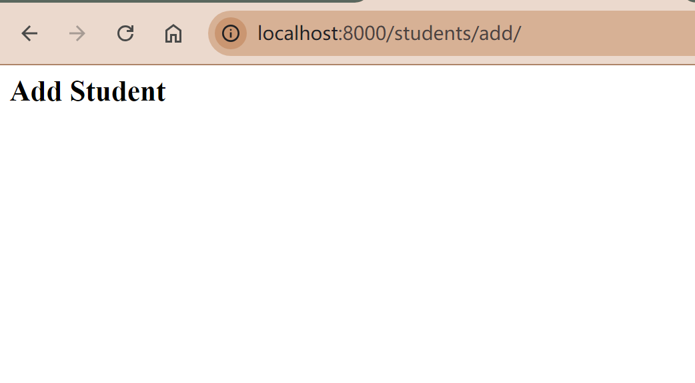

# Student Management System Report
## 1. Project Setup
### Set up the development environment
// TODO:
### Start the Django project
In the console, use the following command to start the Django project.
```
django-admin startproject student_management .
```
Note: If there is no dot at the end, Django will create a nested project directory, e.g. `/student_management/student_management`.
Use the following command to run the project.
```
py manage.py runserver
```
The project runs successfully.


### Add the students app

## 2. Create Student Model
### Describe the database schema in models.py
### Create a migration
### Apply the migrations and create databases

## 3. Set up admin interface
### Apply existing migrations
```shell
(venv) D:\24fall-term\GNG5300\Django-projects\student_management>python manage.py migrate
Operations to perform:
  Apply all migrations: admin, auth, contenttypes, sessions, students
Running migrations:
  ...
```
### Add a superuser
```
python manage.py createsuperuser
```
Navigate to `http://localhost:8000/admin/` and log in with the credentials to see the following page:


### Register the Student model and customize the list display
In the students folder, find admin.py and register the model using the following code:
```python
from django.contrib import admin
from .models import Student

# Register your models here.
class StudentAdmin(admin.ModelAdmin):
    list_display = ('first_name', 'last_name', 'enrollment_date')
    ordering = ('-enrollment_date',)

admin.site.register(Student, StudentAdmin)
```
Now the Student model is visible in the admin page, and it only displays the first name, last name, and enrollment date.


## 4. Views and Templates
I created four view functions for my students app in the `views.py` file in the `students/` directory:
- **students_list( )** will display a list of all students.
- **students_detail( )** will display the detail of one student. 
- **students_add( )** will later show a form to allow users to add a new student.
- **students_edit( )** will later show a form to allow users to update information of an existing student.

```python
# students/views.py
from django.shortcuts import render
from students.models import Student

'''Display a list of all students'''
def students_list(request):
    students = Student.objects.all().order_by('-enrollment_date')
    context = {
        'students': students,
    }
    return render(request, 'students/list.html', context)

'''Display the details of a single student'''
def students_detail(request, student_id):
    student = Student.objects.get(id=student_id)
    context = {
        'student': student,
    }
    return render(request, 'students/detail.html', context)

'''Add a new student'''
def students_add(request):
    return render(request, 'students/add.html')

'''Edit an existing student'''
def students_edit(request, student_id):
    student = Student.objects.get(id=student_id)
    context = {
        'student': student,
    }
    return render(request, 'students/edit.html', context)
```
After adding corresponding templates for each view, this is what each web page looks like:
### Display a list of all students

Url:  `http://localhost:8000/students/`
It displays a list of all students, with detail and edit button at the end of each row. It also has a button for adding a new student at the end of the list.
### Display the details of a single student

Url: `http://localhost:8000/students/detail/1/`
It shows details of a single student and has a button for editing the student's information.
### Add a new student

It is an empty page for now.
### Edit an existing student’s information

It is an empty page for now.

## 5. Forms
### Add a student
1. Create `forms.py` under `students` app folder, add the `StudentForm` class with all the fields of student.
```python
# students/forms.py
from django import forms

class StudentForm(forms.Form):
    first_name = forms.CharField(max_length=100)
    last_name = forms.CharField(max_length=100)
    email = forms.EmailField()
    date_of_birth = forms.DateField()
    enrollment_date = forms.DateField()
    grade = forms.IntegerField(min_value=1, max_value=12)

```
2. Update `views.py`
```py
# students/views.py
'''Add a new student'''
def students_add(request):
    form = StudentForm()
    if request.method == 'POST':
        form = StudentForm(request.POST)
        if form.is_valid():
            student = Student(
                first_name=form.cleaned_data['first_name'],
                last_name=form.cleaned_data['last_name'],
                email=form.cleaned_data['email'],
                date_of_birth=form.cleaned_data['date_of_birth'],
                enrollment_date=form.cleaned_data['enrollment_date'],
                grade=form.cleaned_data['grade'],
            )
            student.save()
            return HttpResponseRedirect('/students/')
    context = {
        'form': StudentForm(),
        }
    return render(request, 'students/add.html', context)
```
3. Update `add.html` template.
```html
<!-- students/templates/students/add.html-->



    <h2>Add a new student</h2>



    <form method="post">
        
        {{ form.as_p }}
        <button type="submit" class="btn btn-primary">Submit</button>
    </form>

```

Now the page for adding students looks:


### Edit information of an existing student
1. Update views.py
```py
'''Edit an existing student'''
def students_edit(request, student_id):
    student = Student.objects.get(id=student_id)
    if request.method == 'POST':
        form = StudentForm(request.POST)
        if form.is_valid():
            student.first_name = form.cleaned_data['first_name']
            student.last_name = form.cleaned_data['last_name']
            student.email = form.cleaned_data['email']
            student.date_of_birth = form.cleaned_data['date_of_birth']
            student.enrollment_date = form.cleaned_data['enrollment_date']
            student.grade = form.cleaned_data['grade']
            student.save()
            return HttpResponseRedirect('/students/')
    context = {
        'student': student,
        'form': StudentForm(initial={
            'first_name': student.first_name,
            'last_name': student.last_name,
            'email': student.email,
            'date_of_birth': student.date_of_birth,
            'enrollment_date': student.enrollment_date,
            'grade': student.grade,
        }),
    }
    return render(request, 'students/edit.html', context)
```
2. Update edit.html template

Add the following code to `edit.html`
```html

    
    <form method="post">
        
        {{ form.as_p }}
        <button type="submit" class="btn btn-primary">Submit</button>
    </form>
    

```

Now we can edit the information of an existing student.
插入视频：

### Delete student information
1. Update `views.py`
   ```py
   '''Delete an existing student'''
    @login_required
    def students_delete(request, student_id):
        student = Student.objects.get(id=student_id)
        student.delete()
        return HttpResponseRedirect('/students/')
   ```
2. Update templates
   Add `delete` button on the list page: `list.html`
   ```html
   <tbody>
            
                <tr>
                    <td>{{ student.first_name }}</td>
                    <!--Other columns...-->
                    <td>
                        <!--Other buttons...-->
                        <a href="" class="btn btn-danger">Delete</a>
                    </td>
                </tr>
            
        </tbody>
   ```

   Also add `delete` button on the student detail page by updating `details.html`.
### Include routes for urls

### Validation for email

### Validation for grades

## 6. User Authentication
In this project, I use Django’s built-in authentication views and decorators to restrict access to authenticated users.
Here I encountered a problem because I did not know how to implement user authentication using Django. I asked ChatGPT for help.
### Set up the authentication system
First, ensure that Django's authentication systme is included in my project settings. It should be configured in `settings.py` by default.
Check `settings.py` to ensure:
```py
INSTALLED_APPS = [
    'django.contrib.admin',
    'django.contrib.auth',
    # other installed apps...
]
```
### Create Login/Logout views
- views: Django provides built-in views for login and logout.
- urls: We still need to include routes for urls to use Django's built-in authentication views.
```python
urlpatterns = [
    # other URL patterns...
    path("login/", auth_views.LoginView.as_view(), name="login"),
    path("logout/", auth_views.LogoutView.as_view(), name="logout"),
]
```
- templates: Create a `login.html` under `templates/registration` directory. Because by default, Django will look for the `login.html` file under `templates/registration` directory.

Now navigate to `http://localhost:8000/students/login/`, we will see the login page:


### Restrict access using
To ensure only authenticated users can operate student records, I need to restrict access to views by using Django’s built-in `@login_required` decorator.

In `views.py`, I apply the `@login_required` decorator to functions which should only be accessed by authenticated users: add, edit and delete students. 
```python
# other imports...
from django.contrib.auth.decorators import login_required

'''Add a new student'''
@login_required
def students_add(request):
    ...

'''Edit an existing student'''
@login_required
def students_edit(request, student_id):
    ...

'''Delete a existing student'''
@login_required
def students_delete(request, student_id):
    ...
```

### Redirect users
After login, users will be redirected to the home page. After logout, users will be redirected to login page. Specify where users will be redirected in `settings.py`.
```python
LOGIN_REDIRECT_URL = '/students/'  # After login, users will be redirected to the home page
LOGOUT_REDIRECT_URL = '/login/'     # After logout, users will be redirected to login
```

### Add user login/logout button on each page
#### Change `base.html`
#### Problem
I get HTTP error code 405 (解释一下意思) at first. After debugging and reading documents, I realized that Django's built-in LogoutView requires a POST method by default.
Therefore I wrap the logout button in a **form** that submits via POST instead of using anchor tag via GET method.

## 7. Search by name

## 8. Pagination
Modify views and templates to implement pagination of students list.
First, import Paginator in `views.py` and add the following codes:
```python
# views.py
def students_list(request):
    # Other codes...

    # Implement pagination (5 students per page)
    paginator = Paginator(students, 5)  # Show 5 students per page
    page_number = request.GET.get('page')  # Get the current page number
    page_obj = paginator.get_page(page_number)  # Get the students for the current page

    context = {
        'students': students,
        'form': form,
        'page_obj': page_obj, # Add page_obj to context
    }
    return render(request, 'students/list.html', context)
```
Now `page_obj` contains the students on page `page_number`.
Then modify the correspoding templates. The loop should now be over `page_obj` instead of the full set of `students`.
```html

```
### Problem and solution
I found that when I used searching, after swithcing pages, the search conditions were gone.
To ensure the search query parameters are maitained in the pagination links, I need to append those parameters to the URLs when generating pagination links(e.g. Previous Page or First Page).
这里贴代码
However, because it requires developers to manually append query parameters to the pagination links, this solution can be quite 繁琐, especially if we use more filter parameters.
A more elegant solution will be:
这里贴新的代码

## 9. Error Handling
### Non-existing student
When user try to access information of a student that does not exist (e.g. by manipulating the url), Django will raise a `DoesNotExist` exception like this:


There are two ways to properly handle such errors, either manually or automatically. I choose to manually catch this error and display a custom "Not Found" page.
First, update `students_detail` view.
```python
# views.py
from django.http import Http404
'''Display the details of a single student'''
def students_detail(request, student_id):
    student = Student.objects.get(id=student_id)
    # Automatic way: If student doesn't exist, a 404 error will be raised
    # student = get_object_or_404(Student, pk=pk)  
    # Manually handle the 404 error
    try:
        student = Student.objects.get(id=student_id)
    except Student.DoesNotExist:
        raise Http404("Student does not exist")
    context = {
        'student': student,
    }
    return render(request, 'students/detail.html', context)
```

Then, create a custom 404 error page in templates called `404.html`. This file should be in the templates of root folder, the same place with `base.html`, because it is a top-level template and should not be tied to any specific functionality.
```html
```
Also modify the debug status and allowed hosts in `settings.py` so that my custom 404 handling page would work:
```py
```
Now when I try to access the detail page of a non-existing student with url `http://127.0.0.1:8000/students/detail/15/` (there is no students with id=15), the custom 404 page will show:


## 10. Input validation

### Input validation in Forms
To implement validation for inputs, `forms.py`, `views.py` and corresponding templates will be modified.

Django usually handles validation for form inputs in `forms.py`. 

By adding `clean_<FieldName>>` function to a form class, we can override the default cleaning process and implement customized cleaning and validation. If the value is invalid, it will raise a `ValidationError`. 

#### Names
To ensure only letters can be used in first names and last names, first we add the following functions to `StudentForm` and `StudentSearchForm` class. The former is for adding a new student and the latter is for searching students.
```python
# Custom validation for first name
    def clean_first_name(self):
        first_name = self.cleaned_data.get('first_name')
        
        # Ensure the name contains only alphabetic characters
        if not re.match(r'^[A-Za-z]+$', first_name):
            raise ValidationError('First name must contain only letters.')
        
        return first_name

    # Custom validation for last name
    def clean_last_name(self):
        last_name = self.cleaned_data.get('last_name')
        
        # Ensure the name contains only alphabetic characters
        if not re.match(r'^[A-Za-z]+$', last_name):
            raise ValidationError('Last name must contain only letters.')
```

#### Dates

#### Email

Next, update `views.py` so that if validation fails, the form with errors will be passed back to the templates:
```html

```

Then the templates
- Generate invalid message under each field.
- Retain values for invalid inputs
#### Problem
I forget grade field when I wrote the edit.html. By printing debug message, I find the mistake and solve it.
```python
if request.method == 'POST':
        form = StudentForm(request.POST)
        if form.is_valid():
            student.first_name = form.cleaned_data['first_name']
            student.last_name = form.cleaned_data['last_name']
            student.email = form.cleaned_data['email']
            student.date_of_birth = form.cleaned_data['date_of_birth']
            student.enrollment_date = form.cleaned_data['enrollment_date']
            student.grade = form.cleaned_data['grade']
            student.save()
            return HttpResponseRedirect('/students/')
        else:
            print("Form is invalid. Errors:", form.errors)  # Debug statement
```
### Input validation in pagination
To ensure that invalid page number input (e.g. `http://127.0.0.1:8000/students/?page=a`) won't crash the page, modify the pagination part in `views.py`. Django will raise a ValueError in the paginator if page number is invalid. I modify my view to default to the first page in such cases:
```py
# views.py
def students_list(request):
    # Other codes...

    # Implement pagination (5 students per page)
    paginator = Paginator(students, 5)  # Show 5 students per page
    page_number = request.GET.get('page')  # Get the current page number
    try:
        page_obj = paginator.get_page(page_number)
    except (ValueError, TypeError):
        page_obj = paginator.get_page(1)  # Default to the first page if the input is invalid
    # page_obj = paginator.get_page(page_number)  # Get the students for the current page

    # Other codes...
```